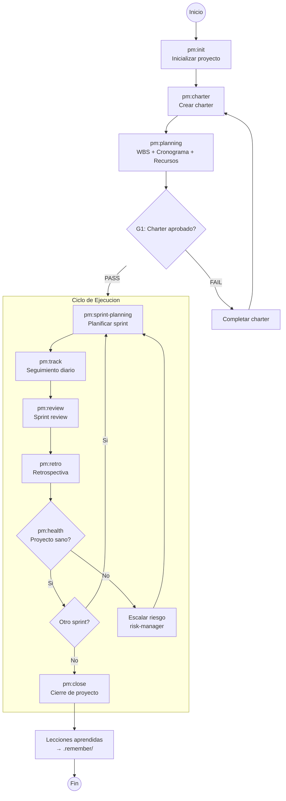
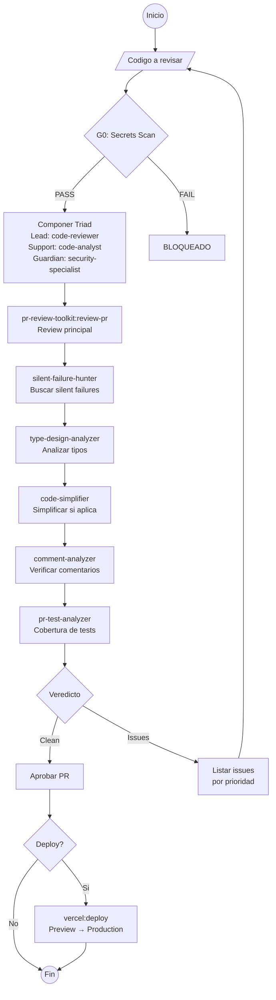
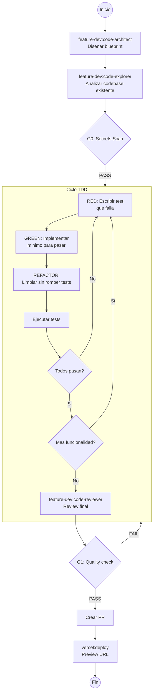
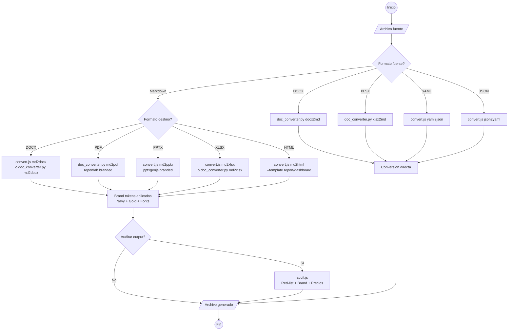
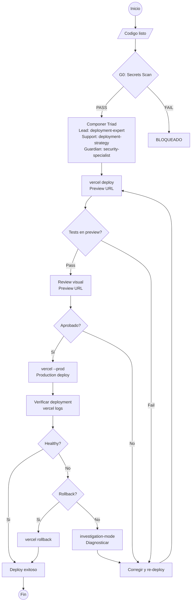
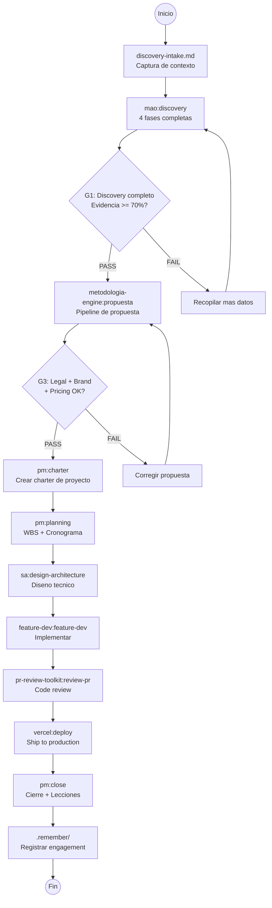

# BPMN Catalog — Flujos de Proceso del ACC

> Cada capacidad del Agentic Command Center modelada como flujo BPMN.
> Formato: Mermaid flowchart. Renderizable en GitHub, VS Code, o el dashboard HTML.
> Nomenclatura: Pools = Plugins, Lanes = Agentes, Tasks = Skills/Commands.

---

## 1. Discovery Completo

```mermaid
flowchart TD
    START((Inicio)) --> INPUT[/Usuario describe necesidad/]
    INPUT --> INTAKE[discovery-intake.md<br>Capturar contexto]
    INTAKE --> G0{G0: Secrets Scan}
    G0 -->|PASS| ROUTE[Intent Router<br>Dominio: Discovery]
    G0 -->|FAIL| BLOCK_G0[BLOQUEADO<br>Resolver credentials]
    ROUTE --> MODE{Modo?}
    MODE -->|Express| EXPRESS[mao:run-express<br>Fases 1-2]
    MODE -->|Guided| GUIDED[mao:discovery<br>4 fases con checkpoints]
    MODE -->|Auto| AUTO[mao:run-auto<br>Pipeline autonomo]

    EXPRESS --> FUNDAMENTAR[Fase 1: Fundamentar<br>AS-IS + Diagnostico]
    GUIDED --> FUNDAMENTAR
    AUTO --> FUNDAMENTAR

    FUNDAMENTAR --> ACELERAR[Fase 2: Acelerar<br>Oportunidades + Gaps]
    ACELERAR --> G1{G1: Completitud >= 70%?}
    G1 -->|PASS| CATALIZAR[Fase 3: Catalizar<br>Solucion + Arquitectura]
    G1 -->|FAIL| REFINAR[Refinar evidencia<br>Mas datos necesarios]
    REFINAR --> FUNDAMENTAR

    CATALIZAR --> AMPLIFICAR[Fase 4: Amplificar<br>Roadmap + Recomendaciones]
    AMPLIFICAR --> WORKSPACE[Crear workspace<br>discovery-{slug}-{fecha}/]
    WORKSPACE --> ARTIFACTS[Generar artefactos<br>Reporte + Hallazgos + Plan]
    ARTIFACTS --> EVIDENCE[Etiquetar evidencia<br>30% rule check]
    EVIDENCE --> DELIVER[/Entregar al usuario/]
    DELIVER --> NEXT{Siguiente paso?}
    NEXT -->|Propuesta| LINK_PROP[Workflow 3:<br>Discovery → Propuesta]
    NEXT -->|Charter| LINK_CHART[pm:charter]
    NEXT -->|Fin| END_D((Fin))
```

---

## 2. Propuesta Comercial

```mermaid
flowchart TD
    START((Inicio)) --> INPUT[/Datos del cliente/]
    INPUT --> NORMALIZE[input-interpreter<br>Normalizar input]
    NORMALIZE --> CATALOG[service-selector<br>Match servicio + segmento]
    CATALOG --> BRAND[brand-resolver<br>own / cobrand / whitelabel]
    BRAND --> COMPOSE[proposal-writer<br>Contenido Minto Complete<br>ES + EN]
    COMPOSE --> LEGAL{G3: Legal Guardian<br>L1-L10 + W1-W7}
    LEGAL -->|APPROVED| GEN[format-producer<br>10 archivos]
    LEGAL -->|WARNINGS| WARN[Aprobar con warnings<br>Listar PC items]
    LEGAL -->|BLOCKED| FIX[Corregir blockers<br>Red-list / Precios / Garantia]
    FIX --> COMPOSE
    WARN --> GEN

    GEN --> HTML[HTML ES + EN]
    GEN --> DOCX[DOCX ES + EN]
    GEN --> PPTX[PPTX ES + EN]
    GEN --> XLSX[XLSX bilingual]
    GEN --> MD[MD ES + EN]
    GEN --> VERIFY[verification-report.md]

    HTML & DOCX & PPTX & XLSX & MD & VERIFY --> WORKSPACE[Guardar en workspace<br>propuesta-{slug}-{fecha}/]
    WORKSPACE --> DELIVER[/Entregar al usuario/]
    DELIVER --> END_P((Fin))
```

---

## 3. Analisis de Arquitectura

```mermaid
flowchart TD
    START((Inicio)) --> INPUT[/Codigo o sistema a analizar/]
    INPUT --> G0{G0: Secrets Scan}
    G0 -->|PASS| TRIAD[Componer Triad<br>Lead: principal-architect<br>Support: solutions-architect<br>Guardian: security-specialist]
    G0 -->|FAIL| BLOCK[BLOQUEADO]

    TRIAD --> ASIS[Fase 1: AS-IS<br>Mapear estado actual]
    ASIS --> FRICTION[Fase 2: Friction<br>Detectar 10 categorias<br>de friccion]
    FRICTION --> G1{G1: Evidencia >= 70%?}
    G1 -->|PASS| DESIGN[Fase 3: Design<br>Arquitectura propuesta]
    G1 -->|FAIL| MORE_DATA[Recopilar mas evidencia]
    MORE_DATA --> ASIS

    DESIGN --> PLAN[Fase 4: Plan<br>Roadmap de implementacion]
    PLAN --> REPORT[Fase 5: Report<br>Generar reporte final]
    REPORT --> WORKSPACE[Crear workspace<br>arch-{subject}-{fecha}/]
    WORKSPACE --> DELIVER[/Reporte + Diagramas<br>+ Recomendaciones/]
    DELIVER --> NEXT{Siguiente paso?}
    NEXT -->|Build| BUILD[feature-dev:feature-dev]
    NEXT -->|Spec| SPEC[sa:generate-spec]
    NEXT -->|ADR| ADR[sa:generate-adr]
    NEXT -->|Fin| END_A((Fin))
```

---

## 4. Gestion de Proyecto



---

## 5. Code Review + Ship



---

## 6. Feature Development (TDD)



---

## 7. Catalogo — Verificacion y Actualizacion

```mermaid
flowchart TD
    START((Inicio)) --> MODE{Operacion?}
    MODE -->|Verificar| VERIFY[metodologia-engine:verificar<br>Full verification]
    MODE -->|Actualizar| UPDATE[metodologia-engine:actualizar-catalogo<br>Update entries]
    MODE -->|Derivar| DERIVE[content-derivation.md<br>Derivar para audiencia]
    MODE -->|Innovar| INNOVATE[mao:validate-feasibility<br>Evaluar nuevo servicio]

    VERIFY --> LOAD[Cargar transversales<br>00-*.md]
    LOAD --> SCAN[Escanear cada servicio]
    SCAN --> PRICE_CHECK{Precios consistentes?}
    PRICE_CHECK -->|Si| LEGAL_CHECK{Legal safety?}
    PRICE_CHECK -->|No| BLOCKER[RED BLOCKER<br>Discrepancia de precio]
    LEGAL_CHECK -->|Si| BRAND_CHECK{Brand safety?}
    LEGAL_CHECK -->|No| WARN_L[YELLOW: Legal warning]
    BRAND_CHECK -->|Si| GREEN[GREEN: Verificado]
    BRAND_CHECK -->|No| WARN_B[YELLOW: Brand warning]

    BLOCKER & WARN_L & WARN_B & GREEN --> REPORT[quality-report-{fecha}.md<br>RED | YELLOW | GREEN counts]
    REPORT --> DELIVER[/Entregar reporte/]

    UPDATE --> CATALOG_Q[catalog-query.js<br>Consultar estado actual]
    CATALOG_Q --> EDIT[Editar services.yaml<br>o conditions.yaml]
    EDIT --> LEGAL{Legal guardian check}
    LEGAL -->|PASS| SAVE[Guardar cambios]
    LEGAL -->|FAIL| FIX[Corregir antes de guardar]
    FIX --> EDIT
    SAVE --> VERIFY

    DERIVE --> CANON[Leer canonico.md]
    CANON --> AUDIENCE[Seleccionar audiencia<br>ejecutiva/comercial/compras/inexperto]
    AUDIENCE --> TRANSFORM[Transformar contenido<br>Reglas por audiencia]
    TRANSFORM --> AUDIT_D[Mini-auditoria<br>Precios + Red-list + PC]
    AUDIT_D --> OUTPUT_D[/Documento derivado/]

    INNOVATE --> FEASIB[Analisis de viabilidad]
    FEASIB --> SKELETON[Draft canonico skeleton]
    SKELETON --> PC_TAG[Marcar TODO como<br>POR CONFIRMAR: JM]
    PC_TAG --> OUTPUT_I[/Draft + Rationale/]

    DELIVER & OUTPUT_D & OUTPUT_I --> END_C((Fin))
```

---

## 8. Conversion de Documentos



---

## 9. Deploy a Produccion



---

## 10. Full Client Engagement (Workflow Cross-Plugin)



---

## Referencia Rapida de Invocacion

| # | Flujo | Trigger Natural | Skill/Comando |
|---|-------|-----------------|---------------|
| 1 | Discovery | "haz un discovery", "diagnostica" | `mao:discovery` |
| 2 | Propuesta | "hazme una propuesta", "cotizacion" | `metodologia-engine:propuesta` |
| 3 | Arquitectura | "analiza la arquitectura" | `sa:analyze` |
| 4 | Proyecto | "planifica el proyecto" | `pm:init` |
| 5 | Code Review | "revisa el codigo", "review PR" | `pr-review-toolkit:review-pr` |
| 6 | Feature TDD | "implementa con TDD" | `feature-dev:feature-dev` |
| 7 | Catalogo | "verifica el catalogo" | `metodologia-engine:verificar` |
| 8 | Conversion | "convierte a PDF/DOCX" | `_scripts/node/convert.js` |
| 9 | Deploy | "deployea a produccion" | `vercel:deploy` |
| 10 | Full Engagement | "engagement completo" | Workflow cross-plugin |
